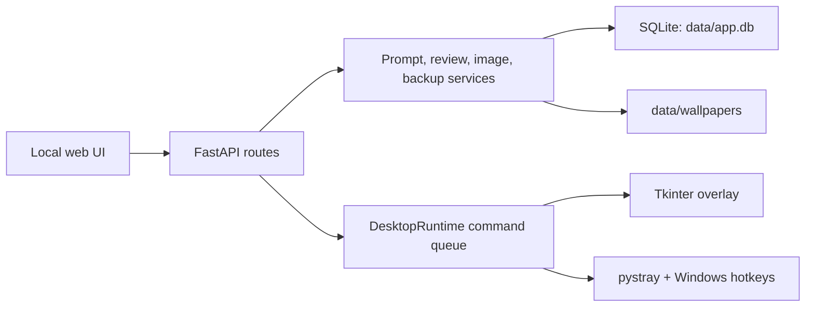

# Architecture

`app.py` initializes the database, mounts static assets, serves the API, starts Uvicorn, and—during normal desktop launch—runs `DesktopRuntime` on the main thread. `backend/routes/api.py` is the HTTP boundary. `backend/services/` owns review scoring, prompt creation, image conversion, wallpaper operations, settings, and SQLite-safe backup. `backend/desktop/` owns monitors, autostart, global hotkeys, tray behavior, and the overlay.

The dependency-free frontend calls JSON endpoints and stores only the UI language in browser local storage. Domain data is persisted in SQLite; image binaries remain on disk. Schema initialization adds missing columns and seeds templates without deleting existing notes.

The source build uses `start.bat` or `launch.vbs`. Services are separated enough to extend scheduling, exports, or rendering independently; a future localization layer should move backend messages and enum labels out of route code.
